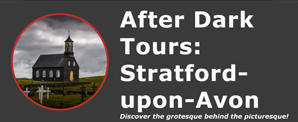
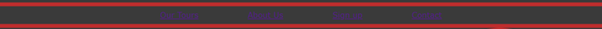
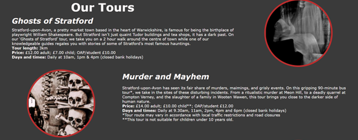
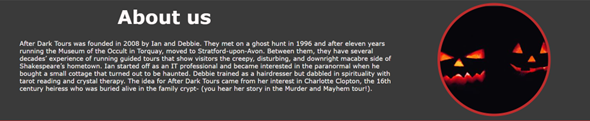

# **After Dark Tours: Stratford-upon-Avon**

After Dark Tours: Stratford-upon-Avon is a website aimed at visitors to the area who want to do something a bit different. Much of the marketing aimed at visitors to Stratford centres around Shakespeare’s birthplace, the theatre, or its many pretty streets and quaint buildings. However, there is a market for people who want an alternative experience and that is what After Dark Tours aims to provide. The site’s objective is to entice visitors to the website to sign up for one of the tours based around the less palatable side of a famous tourist town. 

## **Features**
### Existing Features
####  Header

The header will be the viewer’s first introduction to ‘After Dark Tours’ and the audience can tell immediately what the site will cover: the dark nasty side of a famous tourist town. 
#### Navigation Bar

The fully responsive nav bar links to the relevant sections on the website in a way that is intuitive.
#### 'Our Tours' 

In the ‘Our Tours’ section, the audience can discover what each tour entails and whether it’s right for them. The viewer can find the times, prices, and duration of each tour at a glance.
#### 'About Us' 

This section adds personal details of the couple who run the tour company, and for many consumers, this is an important factor. The story of Ian and Debbie, whose second life careers consist of a somewhat quirky interest that they have been able to monetise will resonate with a lot of people. A lot of tourists don’t want to put money into large corporations and receive a cookie-cutter experience, they want something more unique and personal. 
#### Sign Up Form

The viewer can sign up for a tour using the sign -up form at the bottom of the site. The form could be easily expanded to include further tours.
#### Footer

The footer features a myriad of ways for the viewer to contact ‘After Dark Tours’ whether by postal address, landline telephone number or social media. 
### Features left to implement
In the future, Ian and Debbie hope to develop the site so customers can book or pay for tours online. 

## **Testing**

* After Dark Tours has a number of responsive design features which means it can be viewed on a variety of screen sizes from desktop through to tablet computers.
* The site is not optimised to be viewed using a mobile device.
* The site has been tested on different browsers: Chrome, Edge, Firefox, and Safari.
* The different sections are easy to read and understandable.
* The form can only be submitted by using the required data: name and email address, plus the selection of one of the three radio buttons and I have confirmed that the submit button works.

### Validator Testing

* HTML: no errors were returned when passing through the W3C validator.
* CSS: no errors were returned when passing through the Jigsaw validator.
* Accessibility: the colours and fonts are easy to read, as assessed by lighthouse in Devtools. 

## **Deployment**
The site was deployed to GitHub. 
* To deploy the project in the GitHub repository, go to the Settings tab and select Pages. 
* Select Master Branch from the dropdown source menu. GitHub will provide the link.

The link to the project can be found here: https://brindle5.github.io/after-dark/#tours

## **Credits**

###  Content:
* The code for the initial CSS formatting and the social media links are from the Code Institute Love Running project.
* The icons for the social media links are from Font Awesome.

### Media:
* The photos are from Pexels and Unsplash.

