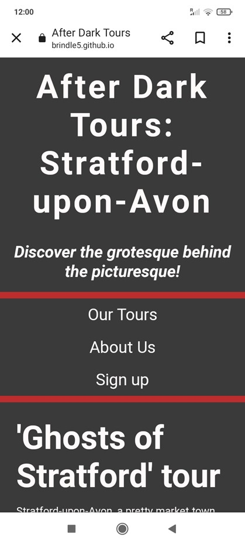
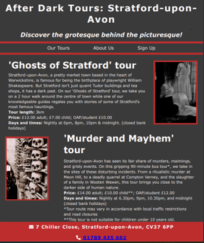
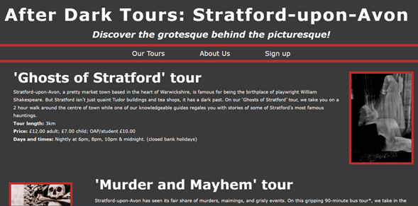
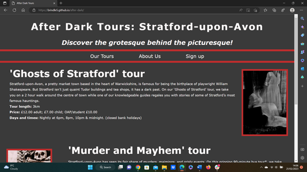
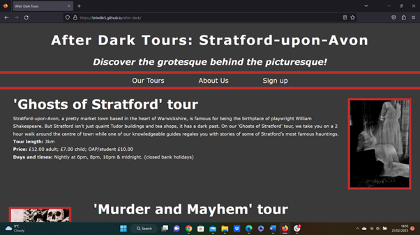

# **After Dark Tours: Stratford-upon-Avon**

After Dark Tours: Stratford-upon-Avon is a website aimed at visitors and tourists who are interesting in the dark, creepy and disturbing history of the area. Much of the marketing aimed at visitors to Stratford centres around Shakespeare’s birthplace, the theatre, or its many pretty streets and quaint buildings. However, there is a market for people who want an alternative experience and that is what After Dark Tours aims to provide. The site’s objective is to entice visitors to the website to sign up for one of the tours based around the less palatable side of a famous tourist town, including hauntings, murders and other grisly occurences. 

## **UX**

#### **Colour scheme**

The colours snow, #BE2D2D (dull red) and #3a3a3a (dark grey) were chosen as they complemented the dark theme of the website but also worked well with regards to readability and accessibility.

#### **Typography- fonts and imagery**

Libre Baskerville was selected as the font for the headings and body of the website due to its Gothic style. 

The images were free from stock photo sites but in the future, Ian and Debbie (the owners of After Dark Tours) would like to commission custom imagery for the site. The background photos selected were felt to complement the different sections of the site, but not distract visitors. 

### **Wireframes**

#### **Changes to my initial design**

I added an “About Us” section so visitors could learn more about the couple who run the tours. This personal element will appeal to After Dark Tours potential customers who hope to have an experience slightly different from many larger operators.

#### **Responsive design**

It was important to keep the continuity of style across different screen sizes, so the images and headings were made slightly smaller. No large changes were made to the layout.

## **Features**

### Existing features

###  Header

 

The header will be the viewer’s first introduction to ‘After Dark Tours’ and the audience can tell immediately what the site will cover: the dark nasty side of a famous tourist town. 

#### Navigation Bar

The fully responsive nav bar links to the relevant section on the website in a way that is intuitive.

#### 'Our Tours' 

In the ‘Our Tours’ section, the audience can discover what each tour entails and whether it’s right for them. The viewer can find the times, prices, and duration of each tour at a glance.

#### 'About Us' 

This section adds personal details of the couple who run the tour company, and for many consumers, this is an important factor. The story of Ian and Debbie, whose second life careers consist of a somewhat quirky interest that they have been able to monetise will resonate with a lot of people. A lot of tourists don’t want to put money into large corporations and receive a cookie-cutter experience, they want something more unique and personal. 

#### Sign Up Form

The viewer can sign up for a tour using the sign -up form at the bottom of the site. The form could be easily expanded to include further tours.

#### Footer

The footer features a myriad of ways for the viewer to contact ‘After Dark Tours’ whether by postal address, landline telephone number or social media. 

### Features left to implement

In the future, Ian and Debbie hope to develop the site so customers can book or pay for tours online. 

## **Testing**

* After Dark Tours has a number of responsive design features which means it can be viewed on a variety of screen sizes.

Mobile phones (screens from 320px to 480px)

Tablet computers (screens from 481px to 768px)

Laptops (screens from 769px to 1024px)

Desktop (screens from 1025px to 1200px)

* The site has been tested on different browsers: 

Chrome: 

Edge:

Firefox: 

Safari:

* The form can only be submitted by using the required data: name and email address, plus the selection of one of the three radio buttons and the submit button works.

### Validator Testing

* HTML: no errors were returned when passing through the W3C validator: 

[HTML validator link](https://validator.w3.org/nu/?doc=https%3A%2F%2Fbrindle5.github.io%2Fafter-dark%2F)

* CSS: no errors were returned when passing through the Jigsaw validator.

[CSS validator link](https://jigsaw.w3.org/css-validator/validator?uri=https%3A%2F%2Fbrindle5.github.io%2Fafter-dark)

* Accessibility: the colours and fonts are easy to read, as assessed by lighthouse in Devtools. 

## **Deployment**

The site was deployed to GitHub pages. The steps to deploy are as follows: 
* In the [GitHub repository](https://github.com/brindle5/after-dark), navigate to the Settings tab 
* From the source section drop-down menu, select the **Main** Branch, then click "Save".
* The page will be automatically refreshed with a detailed ribbon display to indicate the successful deployment.

The live link can be found [here](https://brindle5.github.io/after-dark)

### Local Deployment

In order to make a local copy of this project, you can clone it. In your IDE Terminal, type the following command to clone my repository:

- `git clone https://github.com/brindle5/after-dark.git`

Alternatively, if using Gitpod, you can click below to create your own workspace using this repository.

## **Credits**

###  Content:

* The code for the initial CSS formatting and the social media links are from the [Code Institute](https://codeinstitute.net/global/) content Love Running project.
* The icons for the social media links are from [Font Awesome](https://fontawesome.com/).

### Media:

The photos are from [pexels.com](https://www.pexels.com/) and [unsplash.com](https://unsplash.com/).

* creepy_church.jpg https://www.pexels.com/photo/photo-of-church-during-daytime-3321255/
* ghosts.jpg https://unsplash.com/photos/MTI-La8-eTA
* tower_of_bones.jpg https://www.pexels.com/photo/decoration-made-with-human-skulls-4997839/
* scary_faces.jpg https://www.pexels.com/photo/lighted-jack-o-lantern-decors-619420/
* skull_on_books.jpg https://www.pexels.com/photo/white-skull-on-white-wooden-table-5095880/

